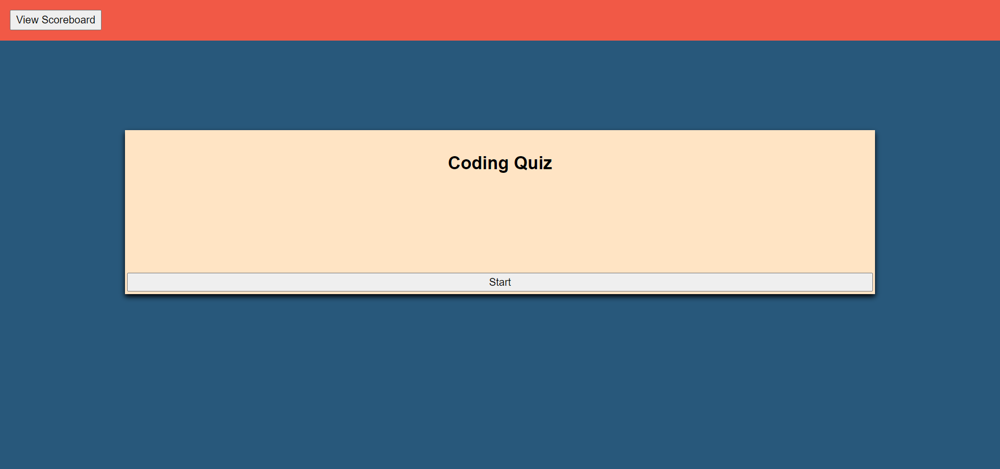
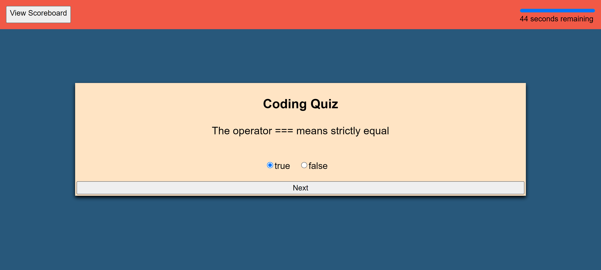
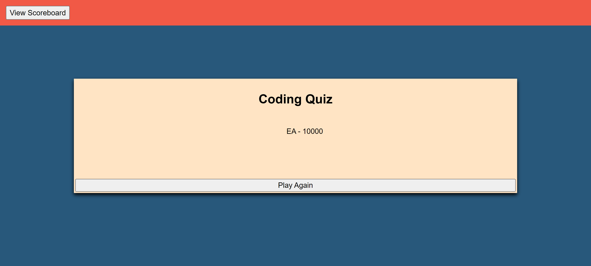

# code-quiz

## Objective

My objective for this assignment was to create an interactive coding quiz. In this assignment, I used the Web API concepts to limit the amount of code in my index.HTML and do the bulk of the work in my JavaScript file. To my knowledge, this assignment should meet the following requirements:
* When the start button is clicked, a timer will begind and a true or false question will appear.
* When a question is answered, another question will appear.
* When an incorrect answer is chosen, ten seconds is subtacted from the overall timer.
* If either the timer reaches zero or the questions are all answered, the game is completed.
* Once the game is completed, the user is prompted to enter their initials.
    * Their initals and score is saved and displayed on a high scores page accessible by clicking the scoreboard button at the top left of the screen.

## Final Page Screenshot

## Final Page Link
- [Code quiz deployed](https://eugene125.github.io/code-quiz/)
- [Code quiz repository](https://github.com/eugene125/code-quiz)

## Contributors
- Kelly Jefferies
- Daniel Norred

## Technologies Used
- HTML
- CSS
- JavaScript

## License

This code is licensed under the MIT License